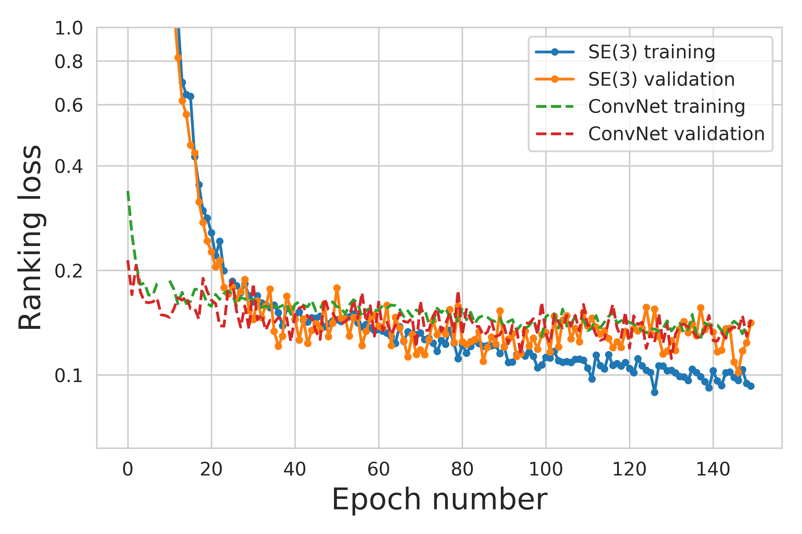

# DeepLocalProteinDocking

# Requirements 
1. PyTorch 1.1
2. TorchProteinLibrary (https://github.com/lupoglaz/TorchProteinLibrary,  commit 16166ce4847ad3ba95cd5afdb8bb4503cad32caa)
3. SE3CNN (https://github.com/mariogeiger/se3cnn)

# Working directories
The directories are defined in *src/__init__.py*.

# Preparing the dataset
The instruction on how to prepare the dataset can be found [here](./scripts/Dataset/README.md)

# Code structure
1. Dataset loaders can be found in *src/Dataset* directory. We use two loaders: one for the generated dataset and one for the DockingBenchmark.

2. Models are defined in *src/Models*. They are split into Protein Representation Models and Docking Models. Additionally, here one can find the ranking loss function and volume multiplication modules

3. Training iteration is defined in *src/Training/LocalTrainer.py*

4. Docking iteration is defined in *src/Docker/Docker.py*

Main scripts for training and testing are: *src/train_local.py* and *src/test_local.py*. Training and testing parameters we used in the paper can be found in *src/server_train_local.sh* and *src/server_test_local.sh*

5. Rotations loading and circular volume plotting can be found in *src/Utils*

We used rotation generated by https://mitchell-lab.biochem.wisc.edu/SOI/index.php that can be found in *data* directory. However, they have different license than this repository. Be sure to obtain the license from MitchellLab.

# Plotting the results
To plot training curve one has to run script *scripts/Results/PlotTraining.py*. The generated loss curve example:

The benchmark results can be computed using script *scripts/Results/PlotBenchmark.py*. Refactoring, work in progress.